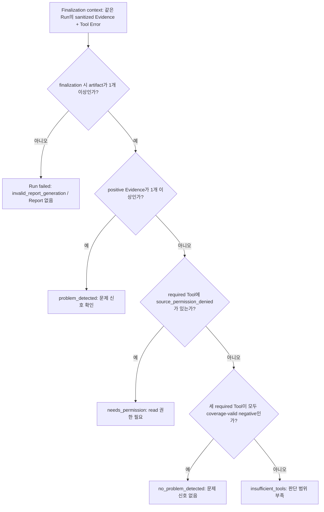
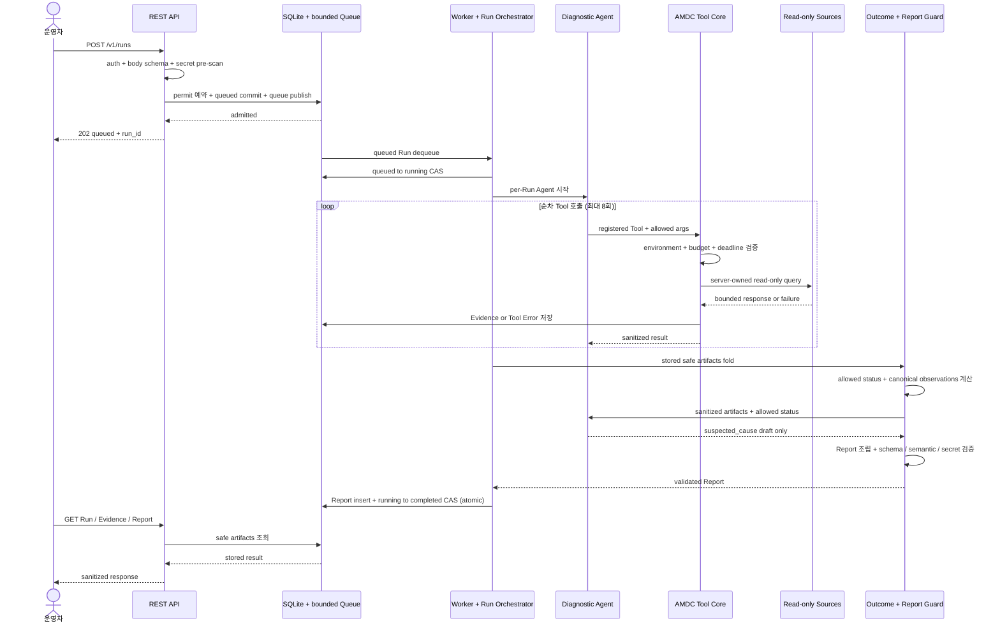
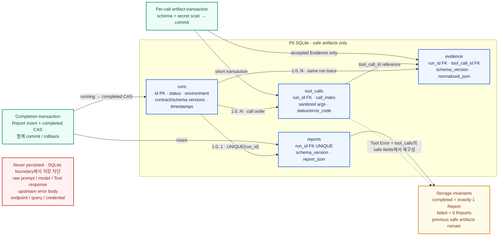
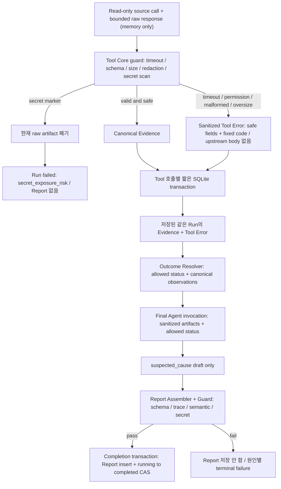

# AMDC

> 운영 이상 신호를 팀이 다시 확인할 수 있는 **sanitized Evidence**와
> **구조화된 진단 Report**로 바꾸는 안전한 read-only 조사 시스템

AMDC는 운영자가 문제 상황을 제출하면 LangChain 진단 Agent가 미리 등록된
read-only Tool 안에서 조사 순서를 선택하고, AMDC가 환경·권한·실행·판정·저장을
통제하는 운영 진단 파이프라인을 목표로 합니다.

AI에게 shell이나 운영 변경 권한을 넘겨 장애를 대신 해결하게 하는 것이 아니라,
제한된 조회를 통해 원인 후보를 좁히고 모든 근거와 실패를 같은 `run_id` 아래
재현 가능하게 남기는 것이 목표입니다.

> [!IMPORTANT]
> 이 저장소는 현재 **P0 설계 및 구현 계약 단계**입니다. Core 계약은 구현 가능한
> 수준으로 정리됐지만 실행 가능한 서버는 아직 없으며, live source mapping도
> 설계 확정 전입니다. 따라서 현재 제공되는 설치·실행 명령은 없습니다.

| 구분 | 현재 상태 | 의미 |
|---|---|---|
| P0 package | `ready_for_design` | Live source 계약 확정이 남아 있음 |
| Core contract | `ready_for_implementation` | API, Run, Tool Core, Evidence/Report 계약 확정 |
| Live source contract | `ready_for_design` | exact PromQL, LogQL, health API mapping 필요 |
| Delivery | `not_started` | 실행 가능한 P0 애플리케이션 없음 |

## 왜 AMDC인가

### Problem

AMDB 운영자는 이상 신호가 발생하면 Backend, Prometheus, Loki 등 여러 시스템을
오가며 원인을 조사합니다. 무엇부터 확인하고 어떤 근거로 결론을 내릴지는
담당자의 경험과 개인 작업 환경에 의존하기 쉽습니다.

### Agitation

이 방식은 초기 조사 시간을 늘리고, timeout·권한 부족·데이터 부재를 정상 상태로
오판하게 만들 수 있습니다. 반대로 AI에 credential, shell, 배포나 재시작 권한까지
주면 secret 노출과 잘못된 환경 실행이라는 더 큰 운영 위험이 생깁니다.

### Solution

AMDC P0는 문제 입력을 비동기 Diagnosis Run으로 만들고, 등록된 read-only
Tool로만 운영 데이터를 조회하도록 설계됐습니다. 조회 결과는 정제된 Evidence
또는 고정된 Tool Error로 남기고, AMDC가 실제 근거와 일치하는 Report만 저장하는
것이 구현 계약입니다. 운영자가 같은 `run_id`로 상태, Evidence, 실패 범위와
결론을 함께 조회할 수 있게 하는 것이 목표입니다.

## 목표 P0 진단 흐름

```text
Operator
  -> Fastify REST API
  -> SQLite Run Store + bounded in-process Queue
  -> LangChain.js Diagnostic Agent
  -> AMDC Tool Core
       -> Prometheus / Loki / AMDB Backend read-only adapters
  -> sanitized Evidence / Tool Error
  -> AMDC Outcome Resolver
  -> schema-valid 7-field Report
  -> SQLite Store + read APIs
```


P0 계약에서 LangChain은 등록된 Tool 중 무엇을 어떤 순서로 확인할지와
`suspected_cause` 가설만 생성하도록 제한됩니다. 환경, endpoint, credential,
query, timeout, call budget, redaction, 최종 status와 저장 transaction은
AMDC가 소유하도록 설계합니다.

| LangChain이 선택하는 것 | AMDC가 고정하고 검증하는 것 |
|---|---|
| 다음에 호출할 등록 Tool | Run의 `dev`/`prod` 환경 |
| 허용 schema 안의 Tool argument | source endpoint, query와 credential |
| Evidence에 따른 조사 순서 | call/time/size budget과 실제 abort |
| `suspected_cause` 가설 | Evidence 정규화, outcome, Report와 SQLite 저장 |

## 첫 진단 시나리오

P0는 `backend_5xx_increase` 한 가지 시나리오에 집중합니다.

| Tool | Read-only source | 확인하는 내용 |
|---|---|---|
| `backend_5xx_rate` | Prometheus | 현재 window와 직전 baseline의 Backend 5xx 비율 비교 |
| `backend_error_log_patterns` | Loki | 같은 시간대의 redacted error pattern 확인 |
| `backend_health` | AMDB Backend | 서비스와 dependency health 확인 |

목표 계약의 AMDC Outcome Resolver는 수집 결과를 다음 네 가지 Report status 중
하나로 판정하도록 정의돼 있습니다.

| Report status | 의미 |
|---|---|
| `problem_detected` | 하나 이상의 positive Evidence가 문제 신호를 직접 뒷받침함 |
| `no_problem_detected` | 세 required check가 모두 완전한 negative Evidence임 |
| `insufficient_tools` | timeout, 실패, no-data 등으로 판단 범위가 부족함 |
| `needs_permission` | positive Evidence는 없고 필수 read source 권한이 부족함 |



계약상 Tool 실패를 정상 Evidence로 바꿀 수 없습니다. 일부 조회가 실패했더라도
이미 positive Evidence가 있다면 문제를 보고하되 누락된 조사 범위를 함께 남겨야
합니다. 위 판정은 위에서 아래 순서로 적용되므로 partial failure가 있어도
positive Evidence가 먼저 확인되면 `problem_detected`가 우선합니다.
`coverage-valid negative`는 metric/log window가 같은 `diagnosticReferenceTime`과
같은 `window_minutes`로 정렬되고 health가 ±30초 freshness를 만족하며, Tool Error와
inconclusive Evidence가 없다는 뜻입니다.

## 계획된 P0 API 계약

아래 endpoint와 예시는 현재 구현이 아니라
[PRD 01](docs/prd/current/01-api-run-and-storage.md)에 확정된 목표 계약입니다.
`GET /healthz` 외의 모든 `/v1` 요청은 shared Bearer token을 요구합니다.
이 token은 API 접근만 인증하며, `requested_by`는 검증된 사용자 identity나
감사 주체가 아닌 표시용 label입니다.

| Method | Endpoint | 역할 |
|---|---|---|
| `GET` | `/healthz` | process와 SQLite 연결 상태 확인 |
| `POST` | `/v1/runs` | 새 Diagnosis Run 생성 |
| `GET` | `/v1/runs` | Run 목록과 filter/cursor 조회 |
| `GET` | `/v1/runs/:runId` | Run 상태 조회 |
| `GET` | `/v1/runs/:runId/evidence` | sanitized Evidence와 Tool Error 조회 |
| `GET` | `/v1/runs/:runId/report` | 완료된 7-field Report 조회 |



위 그림은 **목표 계약이며 아직 구현된 실행 화면이 아닙니다.** 특히 `202`는
queued Run commit과 queue publish가 모두 끝난 뒤에만 반환하도록 설계합니다.

계획된 Run 생성 요청:

```json
{
  "scenario": "backend_5xx_increase",
  "environment": "dev",
  "problem": "최근 10분 동안 AMDB Backend 5xx가 증가했다.",
  "requested_by": "operator-alias"
}
```

계획된 `202 Accepted` 응답:

```json
{
  "request_id": "req_01J...",
  "run_id": "run_01J...",
  "status": "queued"
}
```

P0 Run status는 `queued | running | completed | failed` 네 가지이며, accepted Run은
SQLite에 저장된 뒤 동일한 ID로 다시 조회할 수 있어야 합니다.

### Run 추적성과 저장 불변식

> 아래 그림은 **목표 저장 계약이며 아직 구현된 DB가 아닙니다.**



Run, Tool 호출, Evidence와 Report는 같은 `run_id`로 추적됩니다. 호출별로 검증된
안전한 artifact를 먼저 짧게 commit하고, 마지막에는 Report insert와
`running -> completed` CAS를 하나의 transaction으로 함께 commit하거나
rollback합니다. 따라서 `completed` Run에는 Report가 정확히 하나 있어야 하며,
`failed` Run에는 Report가 없어야 합니다. Tool Error는 별도 table이 아니라
`tool_calls`의 안전한 필드에서 재구성합니다.

## P0 구현 계약의 안전 경계

P0 runtime은 구현 시 다음 규칙을 강제해야 합니다.



- Sanitized Tool Error는 `tool_call_id`, Tool/source, fixed code, `retryable=false`,
  timestamp만 보존하고 upstream body, exception, URL, query와 credential은 버립니다.
- Tool을 startup 시 정적으로 등록하고 모두 `readOnly: true`로 제한합니다.
- Agent-visible input에 environment, endpoint, credential과 query를 노출하지
  않습니다.
- Tool Core가 allowlist, 입력 schema, budget, timeout, response size와 redaction을
  한 경로에서 강제해야 합니다.
- raw Tool output, raw provider response와 upstream error body를 저장하지 않습니다.
- Evidence, Tool Error와 Report는 JSON Schema뿐 아니라 실제 같은 Run의 근거와
  일치하는지 semantic validation도 통과해야 합니다.
- secret marker를 발견하면 해당 artifact를 폐기하고 fail-closed해야 합니다.
- `no_problem_detected`는 세 required Tool의 완전한 negative coverage가 있을 때만
  허용해야 합니다.

현재 P0 계약은 MCP, dynamic plugin, shell, SSH, provider CLI, arbitrary
SQL/HTTP, 배포, 재시작, 삭제, 설정 변경과 mutation/remediation 경로를 명시적으로
제외합니다.

## 범위

### P0에 포함

- Node.js 20+ / TypeScript strict mode 단일 프로세스
- Fastify REST API와 shared Bearer 인증
- SQLite Run Store와 bounded in-process Queue
- LangChain.js Diagnostic Agent와 OpenAI provider adapter
- 정적 Tool Registry와 AMDC Tool Core
- test-only fake model/Tool을 이용한 재현 가능한 검증
- canonical Evidence, sanitized Tool Error, 7-field Report
- secret scan, redaction, schema/semantic validation
- structured logs, metrics, failure injection과 rollback 검증

### P0에 포함하지 않음

- Web UI, 사용자 계정, RBAC/SSO
- Discord/Slack 등 대화형 입력 adapter와 notification
- Trigger, scheduler, webhook과 자동 재진단
- 과거 장애 검색, 사례 DB, RAG/vector DB
- distributed queue, multi-replica와 Run resume
- 추가 장애 시나리오와 동적 Tool discovery
- 승인 실행, 자동 복구와 모든 운영 mutation

최근 기획에서 논의된 Discord Slash Command, 사례 기반 검색, 진단-보고 피드백
루프와 human handoff는 후속 검토 후보입니다. 각각 별도 PRD와 안전성·성과
gate를 통과하기 전에는 현재 기능이나 확정 로드맵으로 간주하지 않습니다.

## P0 완료 판단 기준

아래 수치는 현재 달성 결과가 아니라
[PRD 04](docs/prd/current/04-verification-and-handoff.md)에 정의된 목표
threshold입니다.

| 검증 축 | Core 완료 기준 |
|---|---|
| Correctness | 네 Report status fixture 통과, 추적 불가능한 observation 0건 |
| Security | secret 노출, prod 오조회와 Tool Core 우회 0건 |
| Reliability | accepted Run의 terminal 상태 중복 0건, automatic retry 0회 |
| Latency | fake E2E 100 Runs의 running p95 ≤ 10초 |
| Read performance | 10,000 fixture Runs에서 각 read endpoint p95 ≤ 300ms |
| Memory | 1,000 fake Runs 후 peak RSS ≤ 256MiB, 마지막 500 Runs의 증가율 ≤ 1MiB/100 Runs |

성능 기준은 Node.js 20.x, production build, test-only fake model/Tools,
4 vCPU·8GiB RAM과 local SSD 환경에서 측정합니다. Live network 결과는 이
deterministic core benchmark와 분리합니다.

## 현재 저장소에서 확인할 수 있는 것

현재 구현된 산출물은 P0 PRD, 아키텍처 요약과 canonical JSON Schema입니다.

```text
.
├─ ARCHITECTURE.md
├─ docs/
│  ├─ prd/current/          # 현재 P0 구현 계약
│  └─ notion-assets/        # 프로젝트 설명용 아키텍처 이미지
└─ schemas/
   ├─ evidence.schema.json
   ├─ tool-error.schema.json
   └─ monitoring-report.schema.json
```

`scripts/`, `config/plugins/`, `tests/fixtures/monitoring/`와 과거 MCP 문서는
의사결정 이력 및 prototype 자산입니다. 현재 P0 runtime이나 구현 완료의 근거로
사용하지 않습니다.

## 구현 로드맵

1. Node.js/TypeScript/Fastify와 current-only test skeleton 구성
2. runtime config, error catalog와 schema validator 구현
3. SQLite repository, Run lifecycle과 bounded queue 구현
4. Bearer auth, Run/Evidence API와 queue admission/recovery 구현
5. static Tool Core와 세 개의 deterministic fake Tool 구현
6. Evidence normalizer, outcome resolver와 fake vertical-slice E2E 검증
7. LangChain/OpenAI adapter와 concurrency·failure·memory test 추가
8. exact PromQL, LogQL, Backend health mapping을 versioned source contract로 확정
9. dev read-only adapter와 smoke/rollback drill 통과 후 Demo Ready 판정

Core는 live credential 없이 검증 가능해야 합니다. Live integration은
[PRD 05](docs/prd/current/05-live-source-integration.md)의 exact mapping과 recorded
fixture가 review되기 전까지 구현 완료로 간주하지 않습니다.

## 문서

| 문서 | 소유 계약 |
|---|---|
| [P0 PRD package](docs/prd/current/README.md) | 현재 구현 문서의 단일 진입점과 상태 |
| [Product scope and decisions](docs/prd/current/00-product-scope-and-decisions.md) | 제품 문제, 기술 선택, runtime과 P0 범위 |
| [API, Run lifecycle and storage](docs/prd/current/01-api-run-and-storage.md) | REST API, 인증, queue, 상태와 SQLite |
| [Agent, Tool Core and first scenario](docs/prd/current/02-agent-tool-core-and-scenario.md) | Agent 권한, Tool interface와 outcome |
| [Evidence, Report and security](docs/prd/current/03-evidence-report-security.md) | artifact schema, redaction과 실패 의미 |
| [Verification and implementation handoff](docs/prd/current/04-verification-and-handoff.md) | 성공 지표, 테스트, 구현 순서와 rollback |
| [Live source integration](docs/prd/current/05-live-source-integration.md) | Prometheus/Loki/Backend exact mapping gate |
| [Architecture summary](ARCHITECTURE.md) | P0 구성요소와 책임 경계 요약 |
| [Evidence schema](schemas/evidence.schema.json) | Sanitized Evidence `1.1.0` |
| [Tool Error schema](schemas/tool-error.schema.json) | Sanitized Tool Error `1.0.0` |
| [Report schema](schemas/monitoring-report.schema.json) | Monitoring Report `1.1.0` |

구현과 계약을 변경할 때는 해당 계약을 소유하는 numbered PRD, 관련 schema와
검증 기준을 함께 갱신합니다. 정확한 live source mapping은 추정하지 않으며,
credential이나 `.env` 값은 문서·로그·fixture에 기록하지 않습니다. README의
계약 다이어그램은 GitHub-native Mermaid로 관리하며 별도 third-party rendering
service, remote icon/font, 실제 source URL·hostname, 계정 식별자와 secret을
포함하지 않습니다.
